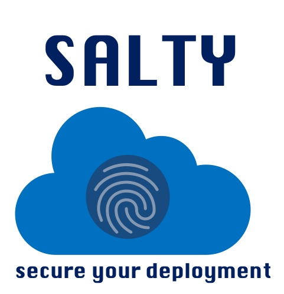

# What is Salty?
To make sure our deplyoment is secure and error free, we take a deeper look on the container images deployed.
In our use case, we mirror multiple Quay registries from one central Quay registry.
To make sure the images didn't change to contain malware, or got corrupted on the way, we run a third party check.

You can find all of Salty's version at docker.io/dolevalgam/salty:[version]

#### Salty v 0.1.0
This version of Salty is a prototype. For now it scans a local registry and compares the images digests with the same images of a remote registry.

# Salty v 0.1.1
New in this version:
* Logging unmatched images to splunk.
* Running scan every 30 min
* Getting local quay in a generic way

### Future Versions
* Develop as a GO OCP Operator to have control over OpenShift use of Images.
* Add cache for disconnected checks.
* Get authentication token from secret, don't have it in the code as clear text.
* Don't scan local images that aren't in mirror state.
